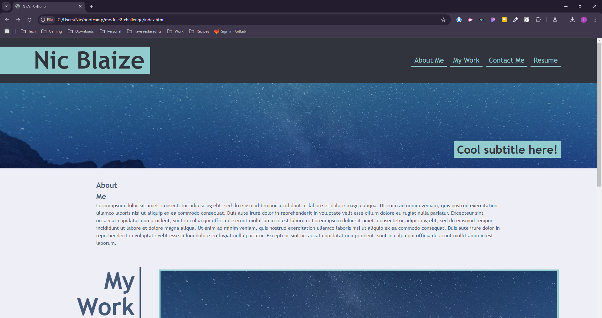

# Module 2: Advanced CSS - Portfolio

## Description

This is my portfolio, built in University of Minnesota's coding bootcamp in 2024. It serves as a place for me to show off every project built in class. It also provides links to my contact information and resume.

## Installation

N/A

## Usage

AS AN employer
I WANT to view a potential employee's deployed portfolio of work samples
SO THAT I can review samples of their work and assess whether they're a good candidate for an open position

    

## Credits

style.css built using starter code from Ed.
reset.css by Josh W Comeau, from https://www.joshwcomeau.com/css/custom-css-reset/

## License

Please refer to the LICENSE in the repo.